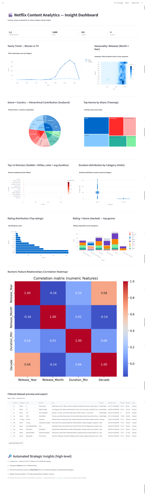

# 🎬 Netflix Content Analytics Dashboard

## 📌 Overview

The **Netflix Content Analytics Dashboard** is an interactive data visualization and analysis application built using **Streamlit**.
It provides deep insights into Netflix’s catalog of movies and TV shows — revealing trends, content composition, geographic distribution, duration analysis, and much more.

This project combines **exploratory data analysis (EDA)** and **interactive visualizations** to help content strategists, analysts, and enthusiasts understand how Netflix's content varies across years, genres, and countries.

---

## 🧠 Objectives

Based on the problem statement and objectives from the accompanying project documentation (`Netflix_Project_Problem_Statement.docx`), the goals are:

- Analyze the distribution of **Movies vs TV Shows** over the years.
- Identify **popular genres, directors, and countries** contributing to Netflix content.
- Examine **duration trends** and **rating compositions**.
- Understand **seasonality** and content release patterns.
- Provide **strategic insights** and recommendations for content planning.

---

## 🧾 Dataset Description

**File:** `Netflix Dataset.csv`
The dataset contains detailed information about movies and TV shows available on Netflix.

| Column Name        | Description |
|--------------------|-------------|
| `Title`            | Name of the content |
| `Category`         | Type of content – Movie or TV Show |
| `Director`         | Name of the director(s) |
| `Cast`             | Leading cast members |
| `Country`          | Country of origin |
| `Release_Date`     | Date of release |
| `Rating`           | Audience rating (e.g., PG, TV-MA) |
| `Duration`         | Duration (minutes or seasons) |
| `Genre` / `Type`   | Genre(s) of the content |

> ⚠️ *Ensure that column names in your dataset match or can be inferred by the script’s preprocessing logic.*

---

## 🧩 Technologies Used

| Category | Tools / Libraries |
|-----------|------------------|
| Programming | Python 3.10+ |
| Framework | [Streamlit](https://streamlit.io) |
| Data Manipulation | Pandas, NumPy |
| Data Visualization | Matplotlib, Seaborn, Plotly |
| Dashboard Styling | Custom CSS, Streamlit Components |

---

## 🚀 Features

### 🎯 Core Functionalities
- **Dynamic filtering** by year, category, genre, and country.
- **Search** by title and director.
- **Interactive visualizations** powered by Plotly.
- **Light-themed UI** with Netflix-inspired accents.

### 📊 Unique Visual Insights
- Yearly trend of Movies vs TV Shows.
- Seasonality heatmap (Month × Year releases).
- Genre–Country **Sunburst** and **Treemap** views.
- Top directors bubble chart (size = number of titles, color = average duration).
- Duration distribution by category (violin plot).
- Rating composition across top genres (stacked bar).
- Numeric correlations (heatmap).
- Auto-generated **strategic insights** section.

---

## 🧮 Project Structure

📁 Netflix-Content-Analytics/
├── Netflix Dataset.csv
├── Netflix_Project_Problem_Statement.docx
├── Netflix_EDA.ipynb
├── streamlit_netflix_dashboard.py
├── README.md
└── requirements.txt

---

## ⚙️ Installation & Setup

### 1️⃣ Clone the Repository
```bash
    git clone https://github.com/yourusername/netflix-content-analytics.git
    cd netflix-content-analytics


### 2️⃣ Create Virtual Environment
```bash
    python -m venv .venv
    source .venv/bin/activate   # For Linux/Mac
    .venv\Scripts\activate      # For Windows


### 3️⃣ Install Dependencies
```bash
    pip install -r requirements.txt


### 4️⃣ Run the Streamlit App
```bash
    streamlit run streamlit_netflix_dashboard.py


### Images


